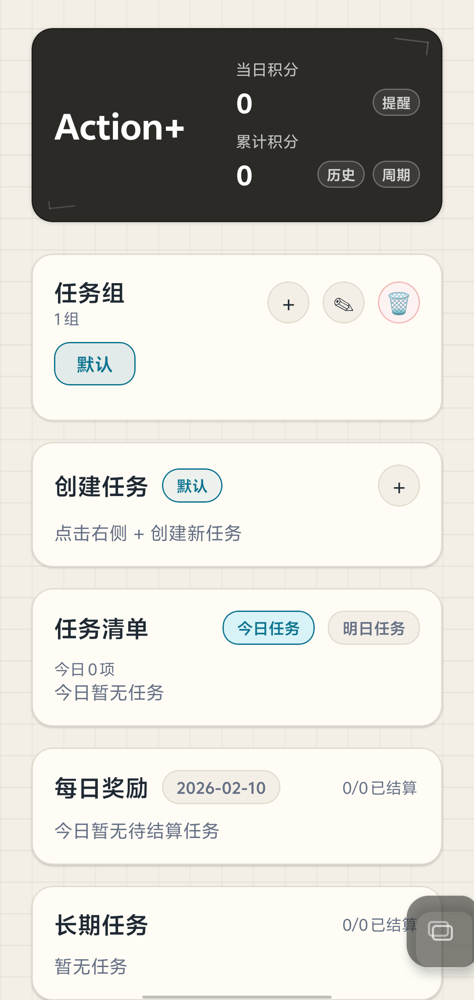
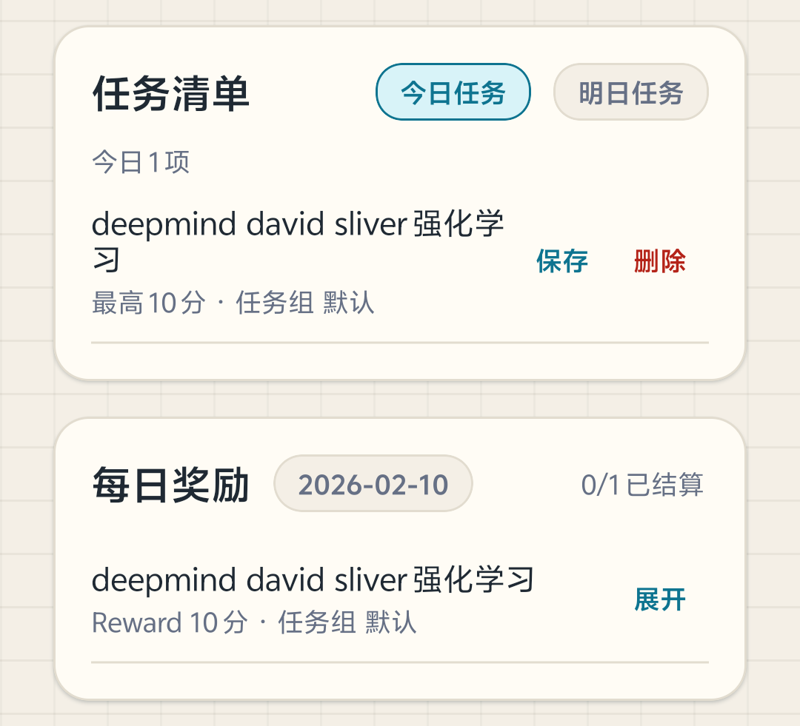
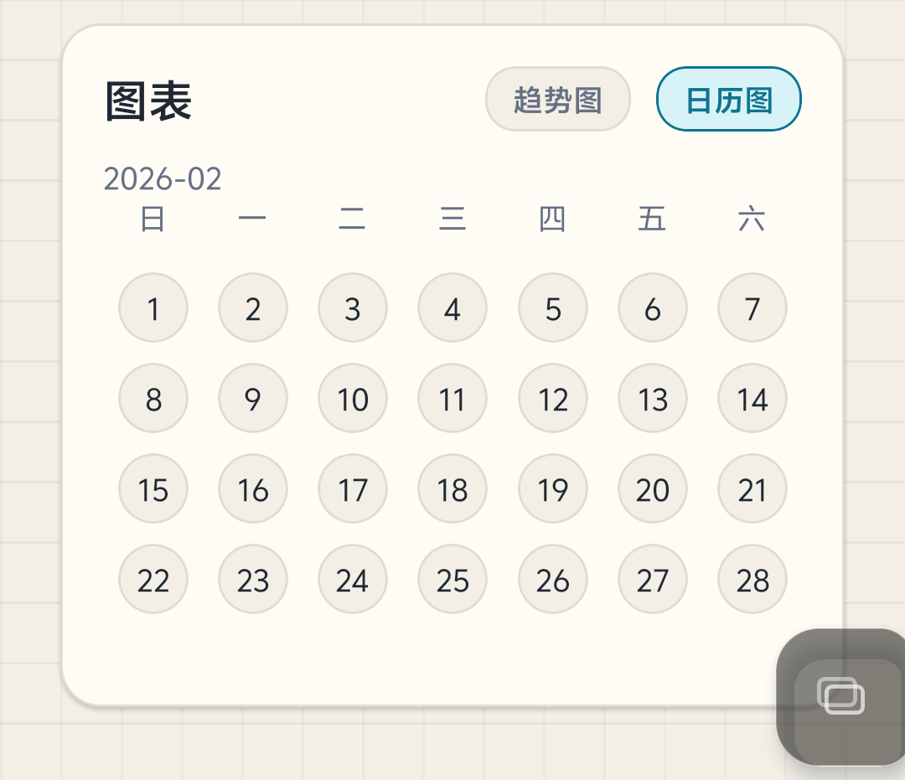
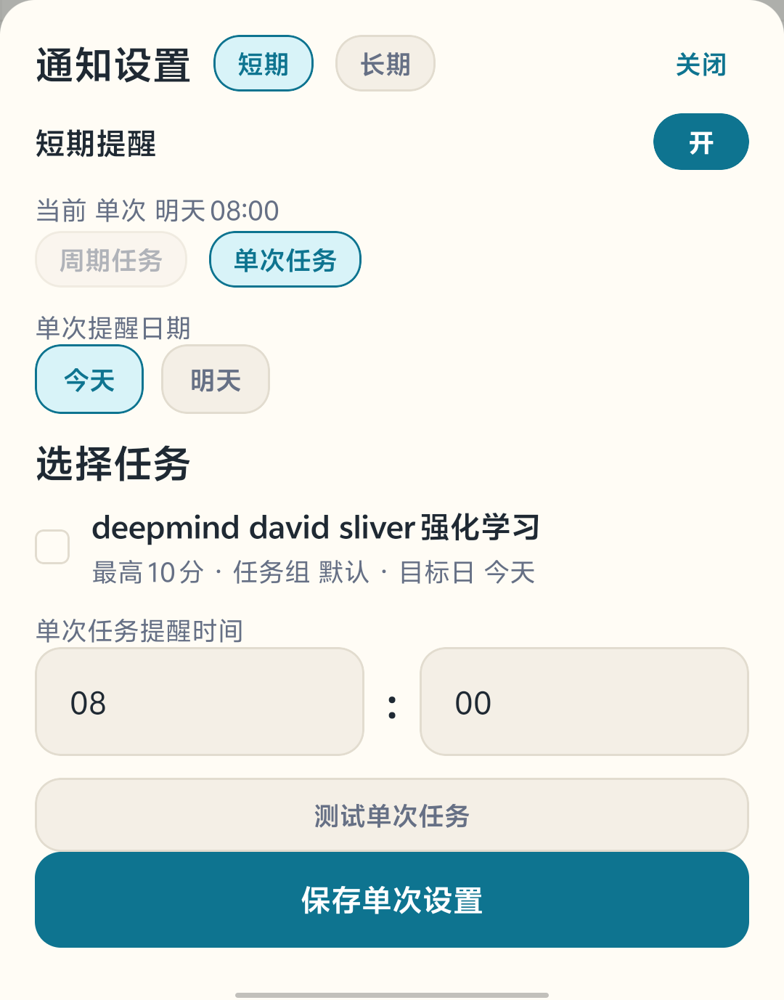

# Action+

<div align="center">
  
  <br/>
  <h3>本地优先的奖励与任务管理应用</h3>
  <p>强化行动与自我反馈的极简工具</p>

  [](https://github.com/EwwwzhI/ActionPlus/releases)
  []()
</div>

---

## 📖 简介 | Introduction

**Action+** 是一款专注于自我管理与正向反馈的移动端应用。它结合了任务管理与游戏化奖励机制，帮助用户通过量化的积分反馈来培养习惯、达成目标。

坚持 **"本地优先"** 的设计理念，所有数据存储在设备本地，确保隐私安全与离线可用。无论是日常琐事还是长期规划，Action+ 都能助你一臂之力。

## ✨ 核心特性 | Features

### 🎯 任务管理
- **灵活的周期配置**：支持每日、工作日、周末等自动重复规则。
- **今日/明日清单**：清晰规划短期目标，支持从任务库快速添加。
- **长期任务追踪**：支持设置截止日期（滚动选择器）与多阶段结算。
- **详细备注便签**：任务执行过程中的细节可随时记录。

### 🎮 游戏化反馈
- **即时奖励结算**：完成任务立即获得积分反馈，强化成就感。
- **任务组与主题**：通过不同颜色区分生活、工作、学习等领域。
- **每日奖励折叠**：精简界面，展开卡片即可查看详情或进行结算。

### 📊 数据可视化
- **积分趋势图**：直观展示近 14 天的努力程度与状态变化。
- **热力日历图**：通过颜色深浅回顾每日投入度。
- **完善的记录**：支持查看每日结算历史，保留最近 120 天数据，支持 CSV 导出。

### 🔔 智能提醒

**配置提醒**
1. 进入通知设置页面（包含**短期**与**长期**两个面板）
2. **短期提醒**：
   - **周期任务**：在“周期任务”页签设置统一时间，勾选需要提醒的任务（遵循每天/工作日/周末规则）
   - **单次任务**：在“单次任务”页签设置独立时间（今天/明天），勾选任务
3. **长期提醒**：
   - 切换到“长期任务”面板，关联提醒时间
   - 配置提前提醒规则（如截止前 7/3/1 天及当天）
4. 开启提醒总开关

**功能特性**
- 🔔 **分层管理**：**短期任务**（周期/单次）与**长期任务**提醒完全解耦
- ⏰ **精准调度**：
  - **周期任务**：自动跟随任务设定的周期（如仅工作日提醒）
  - **单次任务**：支持仅针对今天或明天的特定时间提醒
  - **长期任务**：支持截止日前多阶段跟进提醒
- ✅ **灵活多选**：各类任务均可独立勾选需要提醒的项目
- 🔘 **一键控制**：支持通知总开关

## 📸 界面预览 | Screenshots

| 首页概览 | 任务详情 | 统计图表 | 通知设置 |
|:---:|:---:|:---:|:---:|
|  |  |  |  |


## 🚀 快速开始 | Getting Started

### 下载安装
目前主要支持 Android 平台。
- **最新版本**: [GitHub Releases](https://github.com/EwwwzhI/ActionPlus/releases/latest)

### 开发构建
本项目基于 [Expo](https://expo.dev) 框架开发。

```bash
# 1. 克隆项目
git clone https://github.com/EwwwzhI/ActionPlus.git

# 2. 安装依赖
npm install

# 3. 启动开发服务器
npm start

# 4. 构建 Android 包 (需配置 EAS)
npm run android
```

## 📚 使用教程 | Tutorial

详细的功能介绍与使用指南请参考官方文档：
👉 [Action+ 使用教程 (Feishu/Lark)](https://seu-riclab.feishu.cn/wiki/F0tYwhNQbioFd1kZ7InceVPZnOc?from=from_copylink)

## 📝 更新日志 | Changelog

查看 [CHANGELOG.md](./CHANGELOG.md) 了解最新版本变动与修复。

## 🤝 贡献 | Contributing

欢迎提交 Issue 或 Pull Request 来改进 Action+！
详见 [CONTRIBUTING.md](./CONTRIBUTING.md)。

## 📄 许可证 | License

本项目采用 MIT 许可证（需确认）。
请在发布前补充 `LICENSE` 文件。
